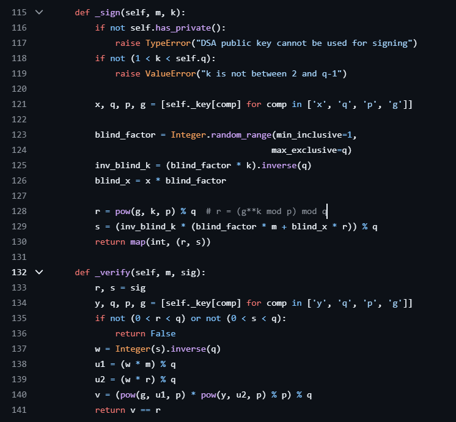

# WriteUp: enmusubi

## 問題文

神社で115円のお賽銭をすると良いご縁に恵まれるみたいですよ。知らんけど。

> ヒント:<br>
> DSAっぽいアルゴリズムが実装されています。正しいDSAの署名検証アルゴリズムとどこが違うか見比べてみましょう。<br>
>  $s $ の値を決め打って（例えば  $s = 1 $ など）、`verify`が通る  $r $ の値を構築してみてください。<br>
> 素数  $p $,  $q $ が115115...の形であることは解法に関係ありません。<br>

## 問題コード
```python
from Crypto.Util.number import isPrime, getRandomRange
from hashlib import sha256

FLAG = "flag{*****REDACTED*****}"

p = 1151151150115115115115115115115011511511511501151151151151151151151151151150110011511511501151151151151151151150115115115115011511511511511511511511511511501100115115115011511511511511511511501151151151150115115115115115115115115115115011001151151150115115115115115115115011511511511501151151151151151151151151151150110115115115011511511511511511511501151151151150115115115115115115115115115115011011511511501151151151151151151150115115115115011511511511511511511511511511501101151151150115115115115115115115011511511511501151151151151151151151151151150110011511511501151151151151151151150115115115115011511511511511511511511511511501101
q = 115115115011511511511511511511501151151151150115115115115115115115115115115011
assert isPrime(p)
assert isPrime(q)
assert p%q == 1

h = 115
g = pow(h, (p-1)//q, p)
assert g > 1
print('g =', g)

x = getRandomRange(1, q)
y = pow(g, x, p)
print('y =', y)

def verify(m, r, s):
    assert r%q != 0
    assert s%q != 0
    z = int(sha256(m).hexdigest(), 16)
    w = pow(s, -1, q)
    return (pow(g, z*w, p) * pow(y, r*w, p) - r) % p == 0
    
print('Give me the signature of "flag"')
r = int(input('r = '))
s = int(input('s = '))

if verify(b'flag', r, s):
    print('Congratulation! The flag is', FLAG)

```


## 概要
ほぼDSAの署名検証が実装されており、検証が成功したらFLAGが出力されます。<br>
`verify`関数の実装ミスを突いて自作の署名で検証を成功させます。

## 詳細

`verify`関数をTrueにすればよい、つまり次の式を満たす  $r $,  $s $ を求めればFLAGを取得できます。

```math
\left(g^{z \cdot w} \cdot y^{r \cdot w} - r\right) \equiv 0 \mod p
```

-  $g $: 大きな素数  $p $ の生成元（generator）
-  $z $: メッセージ  $m $ のハッシュ値から導出
-  $w $:  $s $ の逆元で、署名検証に使用
-  $p $: 暗号アルゴリズムの基盤となる素数
-  $y $: 公開鍵の一部で  $y = g^x \mod p $
-  $r $: 任意に定められる
-  $s $: 任意に定められる

着眼点は`assert r%q != 0`です。本来のDSAでは`assert 0<r<q`です。

### ステップ 1: s=1による計算の簡略化

まず、計算を簡略化するために、  $s = 1 $ で解けると仮定して解きます。 $w=1 $となり、式は次のように単純化されます：
```math
r \equiv g^z \cdot y^r \mod p
```

この式を満たす  $r $ を見つける必要があります。

### ステップ 2:  $r $ の変形

 $r $ を次のように変形しました：

```math
r = aq + 1
```

フェルマーの小定理を後続で用いるため、 $a \in \frac{p-1}{q}\mathbb{Z} $ とします。<br>
なお、`assert p%q == 1`、つまり $p-1 $は $q $で割り切れます。<br>
より厳密には $r = aq + b ,b \in \mathbb{Z} $とすべきですが、b=1で解けると予想しています。<br>

### ステップ 3: フェルマーの小定理の適用

フェルマーの小定理を適用すると、 $y^r \equiv y \mod p $ であることがわかります。これにより、次の式が得られます：

```math
aq + 1 \equiv g^z \cdot y \mod p
```

この式を満たす  $a $ を見つける必要があります。

### ステップ 4:  $a $ の導出

 $a $ の値を以下のように導出します：

```math
a \equiv \frac{g^z \cdot y - 1}{q}  \mod p
```

ただし、これは $m\in \mathbb{Z} $ を含む一般解として、次の形で表すことができます：

```math
a = \left(\frac{g^z \cdot y - 1}{q} \mod p\right) + mp
```
今一度、 $a \in \frac{p-1}{q}\mathbb{Z} $ に注意します。<br>
ここで、 $m = 0 $ と仮定して  $r $ を計算してみることにしました。

### ステップ 5:  $r $ の計算と検証

 $m = 0 $ と仮定すると、 $r $ は次のように計算されます：

```math
r = \left(\frac{g^z \cdot y - 1}{q} \mod p\right) \times q + 1
```

この値を使って問題の式を再度検証したところ、計算が成功しました。

### ステップ 6: 解答コード
```python
from Crypto.Util.number import isPrime, getRandomRange, inverse
from hashlib import sha256

# フラグの定義
FLAG = "flag{*****REDACTED*****}"

p = 1151151150115115115115115115115011511511511501151151151151151151151151151150110011511511501151151151151151151150115115115115011511511511511511511511511511501100115115115011511511511511511511501151151151150115115115115115115115115115115011001151151150115115115115115115115011511511511501151151151151151151151151151150110115115115011511511511511511511501151151151150115115115115115115115115115115011011511511501151151151151151151150115115115115011511511511511511511511511511501101151151150115115115115115115115011511511511501151151151151151151151151151150110011511511501151151151151151151150115115115115011511511511511511511511511511501101
q = 115115115011511511511511511511501151151151150115115115115115115115115115115011

assert isPrime(p)
assert isPrime(q)
assert p % q == 1

h = 115
g = pow(h, (p-1)//q, p)
assert g > 1
print('g =', g)

x = getRandomRange(1, q)
y = pow(g, x, p)
print('y =', y)

def verify(m, r, s):
    assert r % q != 0
    assert s % q != 0
    z = int(sha256(m

).hexdigest(), 16)
    w = inverse(s, q)
    v= pow(g, z * w, p) * pow(y, r * w, p)
    print('v ',v)
    return (v - r) % p == 0

m = b'flag'
z = int(sha256(m).hexdigest(), 16)

r = (pow(g,z,p)*y-1)*pow(q,-1,p)*q+1

s = 1
print('r ',r)
if verify(m, r, s):
    print('Congratulation! The flag is', FLAG)
else:
    print('Verification failed.')

```

### 結論

今回の問題で必要なテクニックは、modulo演算とフェルマーの小定理でした。<br>
最も重要なステップは、 $r = g^z \cdot y^r \equiv 0 \mod p $で $y^r $の指数部分を消すため $r = aq + 1 $の形に変形することでした。

### 宿題
ステップ4で作ったaについて、 $a \in \frac{p-1}{q}\mathbb{Z} $であることと、 $m=0 $で成功すことを証明してください。

## おまけ
今回の問題と、正規のDSA実装を比較するため、DSAのサンプルを作成しました。
```python
from Crypto.PublicKey import DSA
from Crypto.Signature import DSS
from Crypto.Hash import SHA256
from Crypto.Random import get_random_bytes

# DSA鍵ペアの生成
key = DSA.generate(2048)

# 公開鍵の取得
public_key = key.publickey()

# 署名するメッセージ
message = b'flag'

# メッセージのハッシュ
h = SHA256.new(message)

# 署名の生成
signer = DSS.new(key, 'fips-186-3')
signature = signer.sign(h)

print("生成された署名:", signature)

# 署名の検証
verifier = DSS.new(public_key, 'fips-186-3')

try:
    verifier.verify(h, signature)
    print("署名が有効です")
except ValueError:
    print("署名が無効です")

# 公開鍵のエクスポート
public_key_pem = public_key.export_key()
print("公開鍵 (PEM形式):")
print(public_key_pem.decode())

# 署名を受け取って検証するコード
def verify_signature(public_key_pem, message, signature):
    public_key = DSA.import_key(public_key_pem)
    verifier = DSS.new(public_key, 'fips-186-3')
    h = SHA256.new(message)
    try:
        verifier.verify(h, signature)
        print("署名が有効です")
    except ValueError:
        print("署名が無効です")

# 署名の検証をテスト
verify_signature(public_key_pem, b'flag', signature)

```
以下の２つの実装について画像を張ります。<br>
本来、`sign`で $r,s $を作成することと、`verify`で`assert 0<r<q`を確認していることがわかります。
- signer.sign
- verifier.verify

<br>
リンク : https://github.com/Legrandin/pycryptodome/blob/master/lib/Crypto/PublicKey/DSA.py